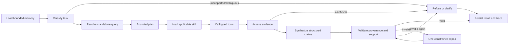

# Design

The detailed ingestion, retrieval, and orchestration design is deferred. The binding initial decisions are recorded in [docs/DECISIONS.md](docs/DECISIONS.md).

## Vertex AI and ADC

Vertex AI with Application Default Credentials was selected instead of the Gemini Developer API and API keys. ADC provides project-scoped Google Cloud identity, works with local developer credentials and workload identities, and avoids distributing application secrets. The provider layer explicitly enables Vertex AI and never falls back to API-key authentication.

## Provider boundaries

Chat and embeddings use separate adapters because they serve different contracts. LangGraph-compatible chat and tool calls use `ChatGoogleGenerativeAI`; embeddings use the official `google-genai` client and distinguish retrieval documents from retrieval queries. Callers depend on narrow interfaces and typed results rather than raw provider responses where practical.

## Credential boundary

The FastAPI backend owns all model access. Docker Compose mounts ADC read-only into that service alone. The frontend, Qdrant, and executor receive neither the credential mount nor Google authentication variables. In particular, the executor remains a restricted trust boundary even when model-driven work is added later.

## Fixed embedding dimensions

The embedding output dimension is explicitly configured as 768 and every response is validated against it. A fixed dimension makes future Qdrant collection schemas deterministic and catches model or configuration changes before incompatible vectors are persisted.

## Source authority and page mapping

The original PDF defines document identity, checksum, page count, page numbers, and portable source reference. Supplied Markdown is preferred for text and tables because it is usually cleaner, but it controls page numbering only when it contains explicit supported markers. Unmarked Markdown is aligned from normalized content anchors and accepted only for a confident unique PDF-page match.

PyMuPDF4LLM is fallback-only: it extracts pages absent from supplied Markdown, pages discarded after an explicit mapping review override, and PDFs without Markdown. This avoids needlessly regenerating curated Markdown while ensuring every accepted page remains traceable to its PDF. Datalab Marker exports are mapped by authoritative sequence only when their declared converted count, PDF page count, skipped-page list, and actual block count all agree; inconsistent zero-based, one-based, or mixed marker labels are not trusted independently.

Ingestion stops on duplicate markers or unresolved alignment unless `--review-override` is present. The override does not approve uncertain page numbers; it replaces uncertain Markdown with extraction from each authoritative PDF page. Known limitations are that image-only PDFs may yield empty pages without OCR, short repeated headers are insufficient alignment anchors, and a Markdown block spanning multiple PDF pages is deliberately rejected for review.

### Coverage contract and OCR quarantine

Every one-based authoritative PDF page receives exactly one typed coverage status. Indexed
provided Markdown, indexed PyMuPDF4LLM fallback, and approved manual transcription are the only
statuses allowed to produce chunks. Reviewed blank and decorative pages are explicit exclusions;
unverified chart and map pages are `excluded_unverified_visual`; uncertain alignment is
`failed_page_mapping`. Coverage reports show indexed percentages and page lists, so exclusion is
never reported as 100% content coverage.

Raw Tesseract output stays under `data/processed/page-review/` and is never an ingestion source.
Token confidence measures recognition of individual glyph sequences; it does not prove that a
district belongs to a detected percentage, a map region belongs to a legend band, or a chart label
belongs to a value. Chunking, embedding, and Qdrant upload independently reject unverified OCR.

Later answer layers can request typed coverage limitations. When reliable indexed evidence is
insufficient, they must say that chart or map pages were excluded because citation-safe extraction
was not possible. They must not infer that information is absent from the PDF. The extension point
for recovering coverage is a checksum-matched, human-reviewed transcription with reviewer identity,
review timestamp, verification notes, and explicit `approved` status. Layout-aware multimodal
extraction is another future option, but its output still requires verification before approval.

## Page-bounded chunks and citations

Chunks never span pages because page number is a required citation invariant. Markdown heading hierarchy is carried into chunk text and metadata. Tables remain whole when they fit; oversized tables split only between rows with headers repeated. Prose uses moderate overlap, while table chunks do not overlap.

Citation snippets are short verbatim substrings selected directly from chunk evidence, excluding heading-only lines where possible. No model writes or paraphrases citations.

Each retrievable payload also carries its page coverage status. Citation snippets must remain
verbatim substrings of the indexed representation, and all chunks must have positive one-based PDF
page numbers and the authoritative source checksum.

## Hybrid retrieval

Semantic retrieval is mandatory, but dense similarity alone can miss exact census numbers, place names, and table labels. Each point therefore stores a 768-dimensional Gemini document vector and a local FastEmbed `Qdrant/bm25` sparse vector. Its English stemming, token limit, average length, `k`, and `b` values are fixed in code and collection metadata. Query vectors use their corresponding query task modes. Qdrant performs reciprocal-rank fusion over named dense and sparse vectors, with document and region filters applied to both candidate sets.

## Idempotency and collection safety

Chunk and Qdrant point IDs are deterministic UUIDs derived from document, page, chunk index, and content. A processed-document state records the authoritative PDF checksum, ingestion version, and point IDs. Unchanged documents with matching Qdrant point counts are skipped before embedding. Dense vectors are additionally cached by content hash, model, dimension, and task type. Changed documents are upserted before stale point IDs are removed.

Collection creation records dense and sparse model configuration as collection metadata. Existing vector sizes, distance, sparse IDF modifier, and model metadata are validated. An incompatible collection is never silently reused or deleted; deletion requires `--rebuild`.

## Retrieval validation and evidence sufficiency

The real-corpus evaluation stores human-verified document/page targets and verbatim source excerpts;
Gemini is used only to embed queries. Each debug search independently executes dense candidates,
local BM25 sparse candidates, and Qdrant reciprocal-rank fusion. Aggregate Recall@5, Recall@10,
MRR, citation-page accuracy, and filter accuracy retain per-case diagnostics rather than hiding misses.

The evidence-sufficiency signal is deliberately conservative and is not an answer. It requires
substantive lexical overlap between query terms and retrieved text, while always marking the
candidate evidence as requiring claim validation. A similarity or fusion score alone cannot prove
that retrieved text entails the requested claim: even an out-of-corpus query receives a dense
nearest neighbour. A later agent must validate claims against exact evidence and account for page
coverage limitations before answering or refusing.

## Citation-grounded conversational graph

The graph has a 16-step recursion limit, at most six tool calls, one repair, and bounded provider
timeouts. Nodes return typed state; `messages` uses LangGraph's message reducer so follow-up turns
append rather than replace history. Classification and query resolution are structured Gemini
operations informed by recent conversation. Factual follow-ups retrieve again because prior
assistant messages are context, not Census evidence. The narrow `source_support` exception does
not trust that prose: it resolves against structured validated-claim history, fetches exact current
Qdrant points by evidence ID, verifies provenance, and rebuilds exact citations without embeddings.

### Memory and persistence boundaries

- `AsyncSqliteSaver` stores short-term graph checkpoints in `workspace/checkpoints.sqlite`, keyed by
  the validated application session ID. When history exceeds the configured threshold, older turns
  are summarized only for preferences, open references, and intent, then removed; source facts are
  deliberately not promoted into memory.
- `workspace/sessions/{session_id}/traces/` stores safe operational events and future artifacts. It
  excludes credentials, prompts, chain-of-thought, tokens, and vectors.
- Qdrant remains the document-knowledge store. Conversation checkpoints never become source
  evidence and never replace citation-safe retrieval.
- Only successful validated claim/citation metadata is retained for at most eight turns: structured
  scope/value/unit, evidence and citation IDs, document IDs, physical pages, and source checksums.
  Failed and refused turns cannot replace it; raw chunks, vectors, prompts, and reasoning are absent.

### Tool and skill contracts

`search_documents` validates a standalone query and optional document/region filters and defaults
to ten results because real-corpus Recall@10 reached 1.00 while relevant evidence sometimes ranked
below five. `list_documents`, `get_document_coverage`, `list_skills`, and `read_skill` expose only
typed metadata. Summary requests enumerate page-distributed section representatives instead of
summarizing the first top-k hits. Comparisons retrieve every requested side independently. The
internal arithmetic helper permits only sum, difference, and percentage difference; general code
execution remains pending Prompt 5.

Skills are non-executable Markdown with validated front matter. Only safe names within the
configured directory are readable, and only the skill matching the classified task is loaded.
Document instructions can never override system safety.

### Claim validation and refusal

Gemini selects retrieved chunk IDs but never supplies citation metadata. The application resolves
document, page, section, and verbatim snippet from current-run evidence. It rejects unknown IDs,
missing claim citations, non-positive or mismatched provenance, non-verbatim snippets, excluded
pages, and heading-only evidence. A structured semantic support check may reject a claim but cannot
override deterministic provenance failures. One constrained repair is allowed; a second failure
returns no unsupported factual answer.

Insufficient evidence produces a citation-safe refusal, while excluded visual coverage is disclosed
without claiming that the fact is absent from the authoritative PDF. Out-of-scope requests explain
the supplied-Census-document boundary. Artifact intents return a typed `capability_pending` result
until Prompt 5 adds the isolated executor and rendering pipeline.

### Structured comparison and checkpoint contracts

Source claims carry structured metric, region, year, population/residence scope, value, unit, and
trusted evidence IDs. Quote matching may normalize markup and equivalent percent wording only while
checking support; displayed evidence is always one untouched contiguous slice of the trusted chunk.
For tables, that slice includes the relevant row and preceding headers. Region identity may come
from trusted document metadata, while population/category context may come from the chunk's trusted
section path.

The application owns comparison arithmetic. Two percentage rates default to an arithmetic
difference measured in percentage points; relative percentage difference is used only when the user
explicitly asks for a percent-higher/lower or relative comparison. Derived claims are generated from
validated calculation results, reference both input claim IDs, and inherit both sources. They are
validated mathematically rather than requiring the derived result to occur in either document.

New checkpoints use schema version 3. Application Pydantic models are converted to JSON-safe
primitives at every graph-node boundary and reconstructed with validated model constructors on node
entry. LangGraph's registered message values remain under its message reducer. Development
checkpoints created before schema version 3 are retained. Successful pre-v3 traces can seed a
bounded claim-history migration, while current Qdrant payloads remain the only source evidence.
