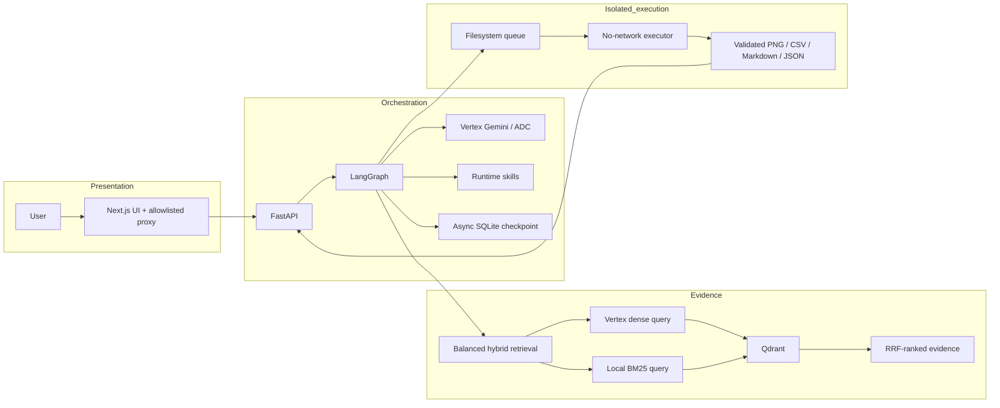
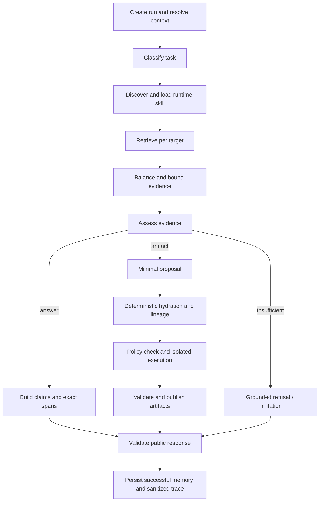
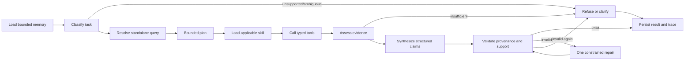

# Design

The binding platform decisions are summarized in [docs/DECISIONS.md](docs/DECISIONS.md). This document records the implemented trust boundaries and tradeoffs.

## System architecture

### Submission hardening

The default deployment is one backend process with a local filesystem and local Docker Compose.
Per-session locks serialize overlapping turns through checkpoint and trace persistence. Multiple API
workers need a shared session lock, which the opt-in Postgres mode provides (see "Production
modes"). Separate sessions can still run concurrently.

Numeric table quotes bind values to row labels and column headers. A semantic assessment must classify
every source claim exactly once; missing or conflicting assessments trigger repair/refusal. These checks
reduce false support but are not a universal parser for every PDF table layout. Difficult layouts can
still cause a safe refusal. Original PDF pages remain authoritative.

Ingestion fingerprints the full extracted chunk content and metadata in addition to the PDF checksum,
so corrected Markdown with the same chunk count cannot silently leave stale vectors. Legacy ingestion
state without this fingerprint is refreshed on the next explicit ingestion.

Published service ports bind to loopback. HTTP administrative ingestion is disabled by default; the CLI
is the supported ingestion path. There is no multi-user authentication: do not expose these services
publicly without an authenticated gateway. The `queue-init` one-shot container receives only the queue
mount, no network or credentials, and prepares permissions for UID 10001 on Linux.

The executor drains stdout and stderr into bounded buffers and kills the process group on overflow.
A separate heartbeat remains current during execution. Linux enforces address-space limits plus the
Docker memory limit. macOS development runs omit unsupported `RLIMIT_AS`; production execution uses
the isolated Linux container. The single worker can queue jobs, but busy queues may exceed a request's
bounded result deadline; another day would add queue admission control. At startup the worker fails
any job a crashed predecessor left in `processing/` with `EXECUTION_INTERRUPTED` and deletes its
unvalidated output. It does not re-run the job, which may be what killed the worker.

Credentials and source evidence stay behind the backend boundary. The presentation plane cannot access Qdrant or runtime files. The execution plane receives a checksum-bound dataset but no credentials, network, source corpus, checkpoints, or Docker socket.

## Next.js UI boundary

The default interface is a Next.js (App Router, TypeScript) client in `web/`. The browser never
talks to FastAPI directly: every call goes to a same-origin route handler
(`web/src/app/api/[...path]/route.ts`) that forwards only an explicit method-and-path allowlist
(`web/src/lib/proxy-rules.ts`, unit tested). Administrative ingestion, raw retrieval search, and the
OpenAPI docs are not reachable through it. The proxy checks the declared body size per route before
reading a body and forwards bodies buffered, so the backend always receives an exact
`Content-Length`. The `web` container runs as UID 1000 with a read-only root, all capabilities
dropped, `no-new-privileges`, resource bounds, only the `frontend_api` network, no volumes, and no
credentials; `scripts/verify_security.py` asserts each of these.

**Sessions.** The backend stores a display transcript per session (`app_messages` in the checkpoint
database) so a conversation can be listed, reopened by URL (`/c/<session_id>`), renamed, and
deleted. The transcript is display-only: nothing reads it back into agent state, follow-up turns
keep using the validated claim history in the LangGraph checkpoint, and a test deletes the whole
transcript mid-conversation to prove memory survives. Deleting a session removes its transcript,
checkpoints, traces, and artifacts under the session lock, so an in-flight turn is never deleted
underneath itself.

**Streaming progress.** `POST /chat/stream` runs the same graph with LangGraph's `tasks` stream
mode and emits a server-sent `progress` event as each node starts, then exactly one `result` or
`error`. Keepalive comments hold idle proxies open. The turn runs in a server task that outlives the
HTTP connection, so a closed tab still produces a saved answer; the client reloads the transcript
instead of retrying. This keeps the existing rule that a chat request is never retried
automatically. It streams progress by node, not tokens: answers are only released after citation
validation, so partial model text is never shown.

**Rendering.** Answers are not rewritten. When the answer body is exactly the validated claims
(the normal cited case), the UI renders those claims as the answer, each with its own citation chips
and, for derived values, the operation computed in code. The plain-text `Sources:` list the backend
appends for text clients is replaced by structured source cards rather than shown twice. Snippets
and table cells render as React-escaped text, and Markdown rendering does not enable raw HTML.

**Checking a citation against the PDF.** `GET /documents/{id}/pages/{n}` renders the physical page
from the authoritative PDF. With a `highlight` snippet it marks text only where a fragment locates
unambiguously, and reports the result in `X-Highlight`. The bundled Census PDFs draw every glyph as
vector paths and have no text layer, so for them the viewer states that the quote cannot be located
automatically rather than implying a match; highlighting works for text-layer uploads.

## Document upload pipeline

`POST /documents/upload` accepts a PDF plus a title and region, then indexes it in the background
(`backend/app/ingestion/uploads.py`). An upload never takes a shortcut around ingestion:

1. An ASGI guard rejects missing or oversized `Content-Length` before Starlette spools anything.
2. The file is validated in memory: PDF signature, opens in PyMuPDF, not password protected, page
   count within limit, not already in the library by SHA-256.
3. The PDF is written atomically under a derived name (`upload-<slug>-<sha>.pdf`, never the client
   filename) with an override manifest in the git-ignored `data/manifests/uploads/`.
4. `IngestionService.ingest` indexes it through the same path as the CLI: PyMuPDF4LLM extraction for
   a newly supplied PDF, page-bounded checksum-bound chunks, dense and BM25 vectors.
5. A failed job is withdrawn before it is removed. A durable marker under
   `data/processed/uploads/withdrawn/` excludes it from retrieval immediately. Its points are
   removed next, and only then its source PDF and manifests, so no chunk ever outlives its source
   PDF. If Qdrant is unreachable, the PDF stays and the cleanup is retried at startup and before
   each job. In the default in-process mode, jobs left running by a restart are marked failed at
   startup; the durable worker mode redelivers them instead (see "Production modes").

Pages without a text layer become `failed_page_mapping` and are excluded, never OCR-guessed. A PDF
with no extractable text fails with that explanation. Only uploaded documents can be deleted over
HTTP. The classifier and resolver receive the live document catalog (IDs, titles, and regions only,
never text), so an uploaded region is in scope under its exact name. Before this, the classifier knew
the corpus only as "Indian Census reports" and asked for clarification about an uploaded region it
did not recognise.

## Deep research

`POST /research/stream` turns a topic into a short brief without weakening any guarantee.

1. **Plan.** One planner call (`GeminiAgentModel.plan_research`) returns headings and 3–5
   questions. It sees the live document catalog and is limited to shapes the agent answers
   reliably: whole-population lookups, two-region comparisons, sex-ratio district rankings, and
   bar charts. Out-of-scope topics return `in_scope=false` with a reason and no sections.
2. **Answer.** Each question runs through the unchanged agent graph in its own hidden child
   session (`app_sessions.parent_session_id`), at most three at a time. Separate sessions stop
   one section's validated memory from resolving another's references.
3. **Assemble.** The brief is the sections' validated responses. Planner text contributes only
   headings and questions, never facts. A declined or failed section is shown as such; nothing
   is backfilled.

The whole brief holds the parent chat's session lock, streams `plan`, `section_started`,
`progress`, `section_done`, and `result` events, and is saved to the transcript as one report
entry. Deleting the chat deletes its child sessions, checkpoints, traces, and artifacts. The UI
exports the brief as Markdown or a print-ready page with one global, deduplicated reference list.

## Trust scorecard

`evals/trust_benchmark.json` holds questions whose answers were verified by hand against the
source tables. `scripts/trust_benchmark.py --allow-paid-calls` asks each one through the live
API and scores it with `backend/app/trust.py`, which is deliberately independent of the agent's
own validation code, so it audits the agent rather than trusting it.

**Ground truth is facts, not numbers.** Each expected answer is a tuple: region, metric, year,
residence, population group, value (for example Odisha, sex ratio, 2011, urban, all persons,
932). A fact is satisfied only by a claim whose own fields state that slot and value. The first
version of the scorer matched expected numbers anywhere in the answer and labels anywhere in the
text. Replaying real recorded answers with deliberate corruptions showed it passed all four of
these: swapped region labels, a rural value stated as the total, a 2011 value labelled 2001, and
a value moved to another region's row. The current scorer fails all four.

**Provenance is checked independently.** `backend/app/trust_provenance.py` parses each cited
quote's Markdown table on its own: it forward-fills the header rows into column paths such as
`Literacy Rate / 2011 / Total`, finds the row labelled with the claim's region, and locates the
value's column. A value must sit on its region's row, in a column whose headers (and statement
context, such as "(FEMALES)") agree with the claim's year, residence, and group. On a recorded
live run, 126 of 127 numeric claims resolved to a specific row and column; the other matched a
prose sentence naming the region.

**Every answer gets one verdict.**

- `wrong_answer`: a claim states a verified slot with another value, a derived value does not
  recompute, or a must-refuse question was answered with numbers.
- `unsupported`: a value is not on its region's row, or the quote's headers contradict the claim.
- `incomplete`: nothing wrong, but a fact, computed value, or artifact is missing.
- `false_refusal`: an answerable question was declined, or answered with no numbers (only a
  clarifying question). Declining is the safe failure and is reported apart from wrong answers.
- `error`: an operational failure.

**The cases probe association, not just recall:** wrong-year columns (2001 figures beside 2011
ones), residence columns (urban vs rural vs total), swapped labels in a comparison (where Madhya
Pradesh's child sex ratio equals its urban sex ratio), subgroup tables (Scheduled Tribes and
Castes), multi-turn follow-ups that name neither region nor metric, a complete district ranking
the agent is known to struggle with, and questions that must be refused.

`--repeat N` asks every case N times, and the scorecard lists cases whose runs disagreed.
`--responses-out` records every raw response, so `scripts/rescore_trust_benchmark.py` can
re-score a run for free after a scorer change. Two recorded live runs are test fixtures:
`backend/tests/test_trust.py` requires the real answers to pass and each corruption of them to
get the right verdict. Transient provider errors get one retry, and the attempt count is
reported. `GET /evaluation/scorecard` serves the latest local run, else the copy shipped in
`evals/`, and the UI renders it at `/trust` with verdicts and a one-click live re-ask per case.

## Statement titles and population subgroups

Census Markdown writes `### Statement 17` followed by a plain title paragraph ("Sex Ratio …
among Scheduled Tribes by residence"). Breadcrumbs come from headings, so every fragment of such
a table was labelled only "Statement 17". A Scheduled Tribes cell (Karnataka, 990) could then
support "the sex ratio of Karnataka was 990" with a valid-looking citation; the state figure is
973. The title paragraph is indexed as its own chunk with the identical breadcrumb, so
`AgentTools` re-attaches it to each table fragment's `section_path` at runtime; text and
offsets are untouched, and no re-ingestion is needed. Deterministic guards then use the title:

- **Citations:** a whole-population claim cannot cite a Scheduled Caste, Scheduled Tribe, or
  child table.
- **Hydration:** refuses such cells.
- **Ranking scans:** exclude such tables.

The prompts also show the title as `SECTION=`. Folding titles into breadcrumbs at ingestion is
the durable fix but re-embeds the corpus, so it is left for an explicit decision.

## Streamlit UI boundary (optional, `--profile streamlit`)

Streamlit provides a compact evaluator-facing chat and artifact interface while FastAPI remains the
only application boundary. The frontend calls public HTTP endpoints and contains its own strict
public-response models; it does not import backend agent, retrieval, or executor code. It has no
Qdrant, checkpoint, execution-queue, artifact-workspace, Vertex, ADC, or Docker-socket access.

Streamlit session state retains only display-ready turns, an in-progress flag, and the backend
session ID. LangGraph checkpoints remain the authoritative conversation memory. Initial state
creates one session, reruns reuse it, and “New conversation” creates a fresh backend session without
deleting old checkpoints, artifacts, or traces. A request fingerprint and submission-in-progress
guard prevent reruns from duplicating a turn. `POST /chat` is never retried: retrying an ambiguous
timeout could duplicate a paid model request even if the backend completed successfully. Only safe
GET health/metadata calls receive one bounded transport retry.

Answers are not rewritten. Structured claims map deterministically to deduplicated citation cards
that show an untouched evidence quote and physical PDF page. Snippets use safe Streamlit text/code
components so Markdown HTML cannot execute. Derived claims retain every input citation.

Artifacts are fetched by allowlisted public filenames only. The client checks filename, MIME type,
byte limit, PNG signature, CSV parsing, and JSON manifest shape before rendering. It never resolves a
filesystem path from API data. A failed artifact download preserves the successful answer and is
reported separately.

Trace input is tolerant of additive backend fields, but the rendered view is an explicit allowlist.
Unknown keys are discarded; credentials, prompts, raw responses, vectors, paths, source chunks, and
full checksums are never recursively displayed. Trace unavailability likewise cannot erase a valid
answer.

The frontend image runs as UID/GID 10002 with a read-only root, all Linux capabilities dropped,
`no-new-privileges`, resource/PID bounds, and a small writable `/tmp`. It receives only the backend
base URL and UI timeout/size settings. Streamlit was selected because its native chat, dataframe,
image, download, and status components demonstrate the typed backend contracts with little browser
code; a richer client could later add URL session restoration, streaming progress, and more durable
local display history.

## Vertex AI and ADC

Vertex AI with Application Default Credentials was selected instead of the Gemini Developer API and API keys. ADC provides project-scoped Google Cloud identity, works with local developer credentials and workload identities, and avoids distributing application secrets. The provider layer explicitly enables Vertex AI and never falls back to API-key authentication.

## Provider boundaries

Chat and embeddings use separate adapters because they serve different contracts. LangGraph-compatible chat and tool calls use `ChatGoogleGenerativeAI`; embeddings use the official `google-genai` client and distinguish retrieval documents from retrieval queries. Callers depend on narrow interfaces and typed results rather than raw provider responses where practical.

## Credential boundary

The FastAPI backend owns all model access. Docker Compose mounts ADC read-only into that service alone. The frontend, Qdrant, and executor receive neither the credential mount nor Google authentication variables. In particular, the executor remains a restricted trust boundary even when model-driven work is added later.

## Fixed embedding dimensions

The embedding output dimension is explicitly configured as 768 and every response is validated against it. A fixed dimension makes future Qdrant collection schemas deterministic and catches model or configuration changes before incompatible vectors are persisted.

## Source authority and page mapping

The original PDF defines document identity, checksum, page count, page numbers, and portable source reference. Supplied Markdown is preferred for text and tables because it is usually cleaner, but it controls page numbering only when it contains explicit supported markers. Unmarked Markdown is aligned from normalized content anchors and accepted only for a confident unique PDF-page match.

PyMuPDF4LLM is fallback-only: it extracts pages absent from supplied Markdown, pages discarded after an explicit mapping review override, and PDFs without Markdown. This avoids needlessly regenerating curated Markdown while ensuring every accepted page remains traceable to its PDF. Datalab Marker exports are mapped by authoritative sequence only when their declared converted count, PDF page count, skipped-page list, and actual block count all agree; inconsistent zero-based, one-based, or mixed marker labels are not trusted independently.

Ingestion stops on duplicate markers or unresolved alignment unless `--review-override` is present. The override does not approve uncertain page numbers; it replaces uncertain Markdown with extraction from each authoritative PDF page. Known limitations are that image-only PDFs may yield empty pages without OCR, short repeated headers are insufficient alignment anchors, and a Markdown block spanning multiple PDF pages is deliberately rejected for review.

### Coverage contract and OCR quarantine

Every one-based authoritative PDF page receives exactly one typed coverage status. Indexed
provided Markdown, indexed PyMuPDF4LLM fallback, and approved manual transcription are the only
statuses allowed to produce chunks. Reviewed blank and decorative pages are explicit exclusions;
unverified chart and map pages are `excluded_unverified_visual`; uncertain alignment is
`failed_page_mapping`. Coverage reports show indexed percentages and page lists, so exclusion is
never reported as 100% content coverage.

Raw Tesseract output stays under `data/processed/page-review/` and is never an ingestion source.
Token confidence measures recognition of individual glyph sequences; it does not prove that a
district belongs to a detected percentage, a map region belongs to a legend band, or a chart label
belongs to a value. Chunking, embedding, and Qdrant upload independently reject unverified OCR.

Later answer layers can request typed coverage limitations. When reliable indexed evidence is
insufficient, they must say that chart or map pages were excluded because citation-safe extraction
was not possible. They must not infer that information is absent from the PDF. The extension point
for recovering coverage is a checksum-matched, human-reviewed transcription with reviewer identity,
review timestamp, verification notes, and explicit `approved` status. Layout-aware multimodal
extraction is another future option, but its output still requires verification before approval.

## Page-bounded chunks and citations

Chunks never span pages because page number is a required citation invariant. Markdown heading hierarchy is carried into chunk text and metadata. Tables remain whole when they fit; oversized tables split only between rows with headers repeated. Prose uses moderate overlap, while table chunks do not overlap.

Citation snippets are short verbatim substrings selected directly from chunk evidence, excluding heading-only lines where possible. No model writes or paraphrases citations.

Each retrievable payload also carries its page coverage status. Citation snippets must remain
verbatim substrings of the indexed representation, and all chunks must have positive one-based PDF
page numbers and the authoritative source checksum.

## Hybrid retrieval

Semantic retrieval is mandatory, but dense similarity alone can miss exact census numbers, place names, and table labels. Each point therefore stores a 768-dimensional Gemini document vector and a local FastEmbed `Qdrant/bm25` sparse vector. Its English stemming, token limit, average length, `k`, and `b` values are fixed in code and collection metadata. Query vectors use their corresponding query task modes. Qdrant performs reciprocal-rank fusion over named dense and sparse vectors, with document and region filters applied to both candidate sets.

## Idempotency and collection safety

Chunk and Qdrant point IDs are deterministic UUIDs derived from document, page, chunk index, and content. A processed-document state records the authoritative PDF checksum, ingestion version, and point IDs. Unchanged documents with matching Qdrant point counts are skipped before embedding. Dense vectors are additionally cached by content hash, model, dimension, and task type. Changed documents are upserted before stale point IDs are removed.

Collection creation records dense and sparse model configuration as collection metadata. Existing vector sizes, distance, sparse IDF modifier, and model metadata are validated. An incompatible collection is never silently reused or deleted; deletion requires `--rebuild`.

## Retrieval validation and evidence sufficiency

The real-corpus evaluation stores human-verified document/page targets and verbatim source excerpts;
Gemini is used only to embed queries. Each debug search independently executes dense candidates,
local BM25 sparse candidates, and Qdrant reciprocal-rank fusion. Aggregate Recall@5, Recall@10,
MRR, citation-page accuracy, and filter accuracy retain per-case diagnostics rather than hiding misses.

The evidence-sufficiency signal is deliberately conservative and is not an answer. It requires
substantive lexical overlap between query terms and retrieved text, while always marking the
candidate evidence as requiring claim validation. A similarity or fusion score alone cannot prove
that retrieved text entails the requested claim: even an out-of-corpus query receives a dense
nearest neighbour. A later agent must validate claims against exact evidence and account for page
coverage limitations before answering or refusing.

## Citation-grounded conversational graph

The graph has a 16-step recursion limit, at most six tool calls, one repair, and bounded provider
timeouts. Nodes return typed state; `messages` uses LangGraph's message reducer so follow-up turns
append rather than replace history. Classification and query resolution are structured Gemini
operations informed by recent conversation. Factual follow-ups retrieve again because prior
assistant messages are context, not Census evidence. The narrow `source_support` exception does
not trust that prose: it resolves against structured validated-claim history, fetches exact current
Qdrant points by evidence ID, verifies provenance, and rebuilds exact citations without embeddings.

### Memory and persistence boundaries

- `AsyncSqliteSaver` stores short-term graph checkpoints in `workspace/checkpoints.sqlite` (or
  `AsyncPostgresSaver` in Postgres mode), keyed by the validated application session ID. When history exceeds the configured threshold, older turns
  are summarized only for preferences, open references, and intent, then removed; source facts are
  deliberately not promoted into memory.
- `workspace/sessions/{session_id}/traces/` stores safe operational events and future artifacts. It
  excludes credentials, prompts, chain-of-thought, tokens, and vectors.
- Qdrant remains the document-knowledge store. Conversation checkpoints never become source
  evidence and never replace citation-safe retrieval.
- Only successful validated claim/citation metadata is retained for at most eight turns: structured
  scope/value/unit, evidence and citation IDs, document IDs, physical pages, and source checksums.
  Failed and refused turns cannot replace it; raw chunks, vectors, prompts, and reasoning are absent.

### Tool and skill contracts

`search_documents` validates a standalone query and optional document/region filters and defaults
to ten results because real-corpus Recall@10 reached 1.00 while relevant evidence sometimes ranked
below five. `list_documents`, `get_document_coverage`, `list_skills`, and `read_skill` expose only
typed metadata. Summary requests enumerate page-distributed section representatives instead of
summarizing the first top-k hits. Comparisons retrieve every requested side independently. The
internal arithmetic helper permits only sum, difference, and percentage difference. Artifact
requests use the separately isolated executor described below.

Skills are non-executable Markdown with validated front matter. Only safe names within the
configured directory are readable, and only the skill matching the classified task is loaded.
Document instructions can never override system safety.

### Claim validation and refusal

Gemini selects retrieved chunk IDs but never supplies citation metadata. The application resolves
document, page, section, and verbatim snippet from current-run evidence. It rejects unknown IDs,
missing claim citations, non-positive or mismatched provenance, non-verbatim snippets, excluded
pages, and heading-only evidence. A structured semantic support check may reject a claim but cannot
override deterministic provenance failures. One constrained repair is allowed; a second failure
returns no unsupported factual answer.

Insufficient evidence produces a citation-safe refusal, while excluded visual coverage is disclosed
without claiming that the fact is absent from the authoritative PDF. Out-of-scope requests explain
the supplied-Census-document boundary. Artifact intents proceed only after source evidence and a
typed dataset pass deterministic validation.

### Structured comparison and checkpoint contracts

Source claims carry structured metric, region, year, population/residence scope, value, unit, and
trusted evidence IDs. Quote matching may normalize markup and equivalent percent wording only while
checking support; displayed evidence is always one untouched contiguous slice of the trusted chunk.
For tables, that slice includes the relevant row and preceding headers. Region identity may come
from trusted document metadata, while population/category context may come from the chunk's trusted
section path.

The application owns comparison arithmetic. Two percentage rates default to an arithmetic
difference measured in percentage points; relative percentage difference is used only when the user
explicitly asks for a percent-higher/lower or relative comparison. Derived claims are generated from
validated calculation results, reference both input claim IDs, and inherit both sources. They are
validated mathematically rather than requiring the derived result to occur in either document.

New checkpoints use schema version 4. Application Pydantic models are converted to JSON-safe
primitives at every graph-node boundary and reconstructed with validated model constructors on node
entry. LangGraph's registered message values remain under its message reducer. Development
checkpoints created before schema version 4 are retained. Successful pre-v3 traces can seed a
bounded claim-history migration, while current Qdrant payloads remain the only source evidence.

## Artifact execution trust boundary

Artifact requests follow classify → resolve → skill discovery/read → evidence retrieval and
assessment → typed dataset construction → lineage validation → Python generation → AST policy →
isolated execution → output/lineage validation → persistence. A correctable runtime or output error
may receive one model-authored code repair; policy violations, timeouts, missing evidence, and
protocol errors never do. A second execution failure stops with no artifact claim.

The backend and executor share only `workspace/execution-queue`. Requests, claims, and results use
temporary-file-plus-rename publication. The worker claims a request by an atomic rename and creates
a unique job directory. After validation, the backend atomically moves that directory to the owning
session's artifact directory. The Docker socket is never mounted: giving generated code indirect
control of Docker would collapse the isolation boundary. The executor also has no network,
credentials, Qdrant access, or session-workspace mount, preventing generated code from contacting
providers or reading another session's files.

`ArtifactDataset` is the sole factual input to generated code. Every numeric source cell maps to an
exact quote and document/checksum/page/chunk provenance. Derived cells retain operation, operands,
result, and source-record IDs. The companion CSV must equal the approved rows, while the manifest
must equal approved lineage; an image alone can never pass. Public endpoints serve only files listed
in a validated execution result and explicitly exclude `generated.py` and `input.json`.

The full `ArtifactDataset` is deliberately not a model constrained-output schema. Gemini proposes a
small, flat `ArtifactDatasetProposal` containing presentation labels, an optional non-authoritative
chart kind, values, semantic scope references, and current-run evidence IDs. Artifact identity is
owned by the validated `ArtifactDataRequirement`; it is absent from the proposal schema. Application
code then binds each proposal row to the exact trusted table
row and metric/year/residence/population column, accepts equivalent decimal formatting, and rejects
unknown, duplicated, ambiguous, or unsupported values. Only application code copies the document,
physical page, chunk, checksum, raw value, and exact quote into `SourceRecord`. The resulting strict
dataset still passes the original dataset and lineage validators before code generation or executor
submission. The schema-size check is a conservative regression guard, not proof of provider
acceptance.

`source_checksum` is mandatory lowercase SHA-256 provenance on every `RetrievedEvidence` object.
Hybrid-search deserialization validates it at the Qdrant boundary, and JSON-safe LangGraph
checkpoint round trips reconstruct the same typed object. Artifact retrieval validates all selected
evidence again before requesting a model proposal. A missing or malformed checksum therefore stops
before paid proposal generation and executor submission with sanitized
`INTERNAL_PROVENANCE_INVALID` HTTP 500 semantics; FastAPI HTTP 422 remains reserved for malformed
incoming request bodies. The model-facing proposal contains no checksum field and cannot override
application-owned provenance.

Population/sex category and residence are independent canonical dimensions shared by artifact and
ordinary claim processing. “Total persons” means Persons with Total residence; Rural and Urban
phrasing overrides that residence default, while Female and Male remain population categories.
Unspecified dimensions are not silently supplied from a model proposal.

Artifact presentation intent is separate from its `ArtifactDataRequirement`. A chart request names
the required metric, year, regions, population scope, and residence scope; retrieval seeks those
numeric inputs, not pre-existing charts. Multi-target artifacts reuse the comparison strategy: one
filtered search per target, followed by deterministic target-aware assessment packing. The packer
reserves a complete value-bearing candidate for each target before filling remaining space and
returns `EVIDENCE_BUDGET_INSUFFICIENT` if those reservations cannot fit. It never silently removes
one side of a comparison. Dataset source records repeat the typed scopes, units, document title,
physical page, chunk, exact quote, and checksum so compatible, complete coverage is validated before
the executor is called.

The executor uses Docker isolation as its primary boundary and AST filtering as defense in depth.
This design reduces risk but is not equivalent to a hardened hostile multi-tenant sandbox: kernel,
container-runtime, resource-accounting, and static-analysis limitations remain.

## Ranking and superlative queries

A question naming no specific target — "which district had the highest sex ratio in Madhya
Pradesh?" — is classified as `artifact_table` with an empty `regions` list and
`artifact_requirement.rank_all=true`/`rank_direction`. The query resolver rewrites the question,
but it cannot drop a ranking the classifier found. Rankings resolve against the structured table
store first (see "Structured tables" below). Otherwise the request reuses the existing
artifact pipeline rather than adding a parallel task type: retrieval switches from per-target
search to a full-document table scan (`collect_metric_table_rows`), evidence assessment becomes
deterministic (a full-table scan needs no per-target LLM relevance judgment), and the same
propose → deterministically hydrate → validate → generate code → execute → validate lineage
sequence used by every other chart/table request applies unchanged.

Two aspects are deliberately **not** delegated to generated code. First, *who wins* is computed by
the application directly from the validated, cited dataset (`prepare_artifact` sorts
`dataset.rows` and takes the extreme value), the same "application owns the arithmetic" posture
already used for comparison differences — generated code never gets to assert the factual answer.
Second, a state/UT aggregate row (e.g. "Madhya Pradesh" itself, present in the same table as its
districts) is excluded from winning: its label is checked against the document's own region before
a claim is built, so a ranking question about districts can never resolve to the state total.
The isolated executor still does real work — it runs model-generated code that reads the same
trusted, pre-sorted dataset and renders the downloadable ranked table, going through the identical
AST-policy, timeout, stdout/stderr-capture, and one-repair-then-refuse path as any other artifact.

A model proposal that silently omits rows (e.g. proposing 12 of 50 districts) would make the
deterministic winner computation correct-looking but wrong. `count_table_entity_rows` in
`backend/app/execution/hydration.py` independently counts distinct entity labels in the same
trusted evidence — excluding repeated table headers and the state aggregate row — and
`prepare_artifact` refuses (`MODEL_OUTPUT_INVALID` / `RANKING_COVERAGE_INCOMPLETE`) rather than
silently ranking over a partial table when the proposal covers fewer rows than it detects. This is
a heuristic lower bound on row count, not an exact parser, but it is a real, tested gate rather
than an assumption that the model enumerated every row.

Ordinary per-region comparisons match a proposed row's label against the trusted chunk's own
`region` field, because that field is document-scoped (one value per state report). Ranking rows
name sub-document entities — districts — whose names never equal that field, so
`hydrate_artifact_dataset`/`_match_row` accept `require_region_label=False` for `rank_all`
requests; the row is still only accepted when its label and value are found together, verbatim, in
a real table row of the trusted evidence. Similarly, a metric like sex ratio has no
male/female/persons column to verify (it is inherently a cross-sex ratio, not sliced by
population category), so `require_population_scope` is relaxed only when the classifier legitimately
left `population_scope` unset for a ranking request; a ranking request that does specify a category
("highest female literacy rate") still has it fully verified against the table, unchanged from
ordinary chart/table requests.

### Structured tables

The proposal path above rebuilds each cell's meaning from chunk fragments, and the chunker keeps
only a table's first header row on later fragments. Literacy tables put 2001 and 2011, each with
Total/Rural/Urban, under one "Literacy Rate" header, so later fragments could not say which column
a value came from, and literacy rankings failed closed. Rankings now resolve against a structured
table store first (`backend/app/tables/`); the proposal path remains only as the fallback.

- **Extraction.** At ingestion, every table with a printed column-number row ("1 | 2 | 3 ...") is
  parsed from the whole Markdown table on the indexed pages. Graph data transcribed from images
  has no such row and is skipped. A blank header cell continues the cell to its left, but only
  under the same parent header, so each column resolves to a metric, year or period, residence,
  population group, and unit. A table takes its title from its "Statement N" heading or paragraph.
  That context ends at the next heading or at a Graph, Map, or Annexure paragraph, so a later
  table never inherits a statement's title. The title contributes the population group
  ("(Persons)") and subgroups (Scheduled Castes, Scheduled Tribes, children).
- **Binding.** A row is usable only when its exact Markdown line occurs in exactly one indexed
  chunk on its page. That chunk is what the answer cites; the store is derived JSON in
  `data/processed/tables/`, never evidence itself, and Qdrant stays the only vector store. On the
  bundled corpus all 5,586 rows of 151 tables bind.
- **Selection.** A column matches when its metric names exactly the requested metric (ignoring
  stop words, years, and units), its table covers exactly the requested subgroups, and its year,
  residence, and population group agree. Defaults are 2011, total, and persons. Several matches
  are accepted only when they hold identical values (Odisha prints its first two chapters twice).
  A blank or uncitable district row, or a malformed row, refuses the column.
- **Query time.** The agent re-reads every cited chunk from Qdrant and requires the same document,
  page, and source checksum, with the row's line still in its text. Otherwise the store is stale,
  and the request falls back to scanning chunks. The dataset is built from every district row
  with no model call, and `validate_dataset` checks it like any other.

The layer only serves district rankings so far. Lookups, comparisons, and charts still bind values
through hydration, and a statement split across pages is joined only when its header repeats.

`make build-tables` builds stores for a collection indexed before they existed. It re-derives
pages from the source files and binds rows to the chunks already in Qdrant, with no model calls.

## Production modes

The default deployment is deliberately single-host. Each production concern is an opt-in mode
that leaves the default unchanged and keeps every trust rule above.

### Shared conversation state (Postgres)

`STATE_DATABASE_URL` switches `backend/app/agent/state.py` from SQLite to
`backend/app/agent/postgres_state.py`. LangGraph checkpoints use `AsyncPostgresSaver`; sessions and
display transcripts use the same schema as SQLite (`app_messages.payload` is JSONB and cascades
with its session). Replacing the checkpointer alone would not have made the API stateless. The
per-session turn lock was an in-process `asyncio.Lock`, so two replicas could run overlapping
turns on one session, and both would extend the same stale checkpoint.

- **Session lock.** A two-key Postgres advisory lock (`pg_advisory_lock(namespace, hash)`), held on
  a dedicated connection for the whole turn. If a replica dies mid-turn, Postgres ends its
  connection and releases the lock, so a crash cannot wedge a session. Lock connections have
  their own pool, so long turns cannot starve checkpoint queries. A hash collision only
  serializes two sessions; it never lets two turns share one.
- **Migrations.** Replicas that start together take a migration advisory lock. They poll with
  `pg_try_advisory_lock` instead of blocking in `pg_advisory_lock`. The integration test for
  concurrent startup found a real deadlock. LangGraph's migrations run
  `CREATE INDEX CONCURRENTLY`, which waits for every open transaction, and a replica blocked in
  `pg_advisory_lock` is one. The cycle runs through the application, so Postgres cannot detect
  it.
- **Verified.** `backend/tests/test_postgres_state.py` runs two `AgentService` instances against a
  real server: memory written by one replica is used by the other, and overlapping turns on two
  replicas serialize. Removing the lock makes that test fail with one surviving turn instead of
  two. Live, a question answered by one replica was followed up on the other. Both containers were
  then recreated, and the session's validated memory and transcript were intact.
- **Limits.** Traces, artifacts, and the executor queue stay on the shared workspace volume, which
  is correct for replicas on one host; across hosts they need object storage. Switching modes does
  not migrate existing SQLite history.

### Durable upload indexing (Celery, Redis)

In-process upload jobs never blocked the event loop: extraction and embedding already ran in a
worker thread. The real gaps were that a restart failed any job in progress and that indexing
shared a CPU with the API. `INGESTION_BROKER_URL` makes the API stage and validate exactly as
before, then enqueue the job to `backend/app/ingestion/worker.py`, which runs the same
`UploadService.run_job`.

- **Delivery.** `acks_late` with `task_reject_on_worker_lost`: a job is acknowledged only when it
  finishes. A worker killed mid-job leaves the message unacknowledged, and Redis redelivers it
  after the visibility timeout. Redis uses append-only persistence, so queued work survives a
  Redis restart.
- **Idempotency.** Deterministic point IDs make a rerun an upsert, and a redelivered message for a
  finished job is a no-op.
- **Retries.** An exception while indexing requeues the job with exponential backoff and keeps the
  source PDF. Only the final attempt fails the job and removes its source and points. A PDF that
  indexes cleanly but yields no citation-safe text fails immediately: retrying cannot change that.
- **Concurrency.** The worker runs one job at a time (shared embedding cache and collection).
  Deleting a document whose job is queued or running returns 409 in both modes, because the
  API's lock cannot reach another process.
- **Verified.** Live, a 60-page upload was killed mid-index with `SIGKILL`. The same task was
  redelivered after the visibility timeout and completed with exactly 60 points: no duplicates
  from the partial first attempt. After deleting the test uploads, the collection returned to its
  canonical 2,058 points.

Celery was chosen because indexing is synchronous code (PyMuPDF and batch embedding) and Celery's
acknowledgement and redelivery semantics are mature. On GCP, Cloud Tasks or Pub/Sub would remove
Redis from the stack.

### Executor under gVisor

`docker-compose.gvisor.yml` changes one thing: the executor's runtime becomes `runsc`. gVisor is a
user-space kernel, not a VM. The sandbox's system calls are served by gVisor's Sentry, so a kernel
exploit from generated code has to break gVisor before it reaches the host kernel. Every existing
control still applies. The executor already polls its queue directory, and the handoff below
confirms it sees files the backend writes from outside the sandbox.
`verify_executor_runtime.py --expect-gvisor` adds a kernel check to the in-sandbox isolation
checks.

This was verified on a real Linux Docker daemon with `runsc` (release 20260921.0). All isolation
checks and all six offline cases passed inside the sandbox, and a full queue handoff from the
backend image produced a validated artifact. The CI job `gvisor-executor` repeats this on every
push.

The same Linux run found an older bug that Docker Desktop hides. `queue-init` changed the queue
root to the executor's UID before creating its subdirectories. It keeps only `CHOWN` and
`FOWNER`, so it could then no longer enter that directory, and a fresh Linux checkout never got a
working queue. It now takes the root back, prepares the children, and hands the root over last.
That also makes restarts work. A microVM per job (Firecracker or Kata Containers) remains the
next step for hostile multi-tenant load.

### Observability and evaluation history (Langfuse)

With `LANGFUSE_BASE_URL`, `LANGFUSE_PUBLIC_KEY`, and `LANGFUSE_SECRET_KEY` set,
`backend/app/observability.py` records:

- one trace per agent turn, grouped by session, with outcome, refusal reason, claim and citation
  counts, and an `answer_status` score;
- one generation per Gemini call, via a small `langchain-core` callback handler rather than the
  `langchain`-dependent integration, with the graph node, model, token usage (including reasoning
  tokens), latency, and error type.

Prompts, evidence, and answers are not sent unless `LANGFUSE_CAPTURE_CONTENT=true`, matching the
local trace contract. A monitoring failure never fails a turn.

- **Feedback.** Thumbs up/down in the UI (`POST /runs/{run_id}/feedback`) is stored beside the
  run's trace and sent as a `user_feedback` score. The Langfuse trace ID derives from the run ID,
  so no mapping is stored.
- **Evaluation history.** `scripts/publish_trust_scorecard.py` (no model calls) records a trust
  scorecard as a Langfuse dataset experiment. Each benchmark case is a dataset item with its
  hand-verified expectation. Each case gets pass, outcome, ungrounded-claim, and latency scores,
  and the run gets answer accuracy, refusal precision and recall, grounded-claim rate, and
  latency percentiles, so model and prompt changes can be compared run by run.
- **No LLM judge.** Scores come from the independent checks in `backend/app/trust.py`. An LLM judge
  never decides numeric grounding; the hard part of scaling the benchmark stays writing verified
  ground truth, not scoring it.

## Tradeoffs, alternatives, and intentionally skipped work

Qdrant was selected as the single vector database because named dense/sparse vectors, payload filters, and server-side RRF keep one provenance-aware retrieval boundary. A relational vector extension would reduce services but would require recreating hybrid-ranking and payload contracts. Vertex Gemini keeps model traffic within GCP and ADC; the tradeoff is cloud configuration and paid live evaluation. LangGraph makes node transitions, retries, checkpointing, and failed-run traces explicit at the cost of more typed state conversion than a linear chain.

Vertex AI/ADC was kept even though the brief specifically named Groq, Nebius, and NVIDIA-style
free-credit providers and asked for a system that is "quick to set up and run end-to-end" on a
reviewer's own machine. The tradeoff was made deliberately, not overlooked: ADC gives project-scoped
Google Cloud identity without distributing an API key (see "Vertex AI and ADC" above), which was
judged worth more than setup speed for this submission. The honest cost is real and is not hidden
elsewhere in this document — a reviewer needs a GCP project with Vertex AI enabled, must run
`gcloud auth application-default login`, and must explicitly opt into one billable step
(`scripts/initialize_corpus.py --allow-paid-calls`) before the system can answer a single question.
That is materially slower to stand up than pasting a free API key into `.env`, and it is the biggest
deviation from the brief's own stated requirements in this submission. With more time, the correct
fix is not a larger executor or retrieval change but a provider swap: move chat/tool-calling to an
OpenAI-compatible free-credit provider (Groq, Nebius, or NVIDIA NIM all support tool calling) and
move dense embeddings to a local FastEmbed model — already a dependency for the sparse/BM25 side —
removing the GCP dependency for retrieval entirely without touching Qdrant, RRF, or citation logic.

Filesystem queueing is intentionally simple and observable for a single-host evaluation. A durable broker would improve horizontal scaling, leases, and backpressure but would add operational surface without strengthening source provenance. SQLite is suitable for short-term single-deployment memory, not multi-region concurrent persistence. Administrative ingestion remains synchronous and explicit through the CLI. User uploads run as in-process background jobs on the same ingestion path and are not retried after a restart. No background crawler, automatic source mutation, raw-OCR ingestion, hidden model fallback, or automatic destructive collection migration was built.

Several items once on this list are now built: URL-restorable sessions and streamed progress (see "Next.js UI boundary"), and shared Postgres state, a durable upload worker, gVisor executor isolation, and evaluation history (see "Production modes"). The remaining priorities are authenticated/TLS service edges, a microVM per executor job, object storage for multi-host deployments, a broker for the executor queue, layout-aware visual extraction followed by human verification, and a licensed corpus distribution or snapshot workflow. None should weaken exact citation spans or the physical-page contract.
