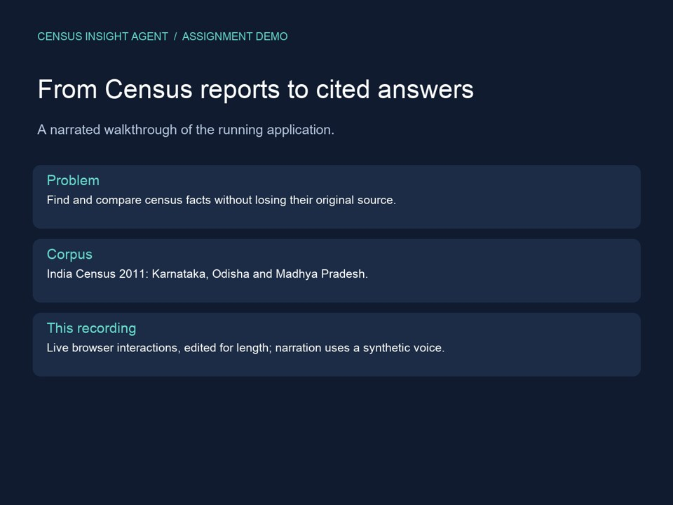
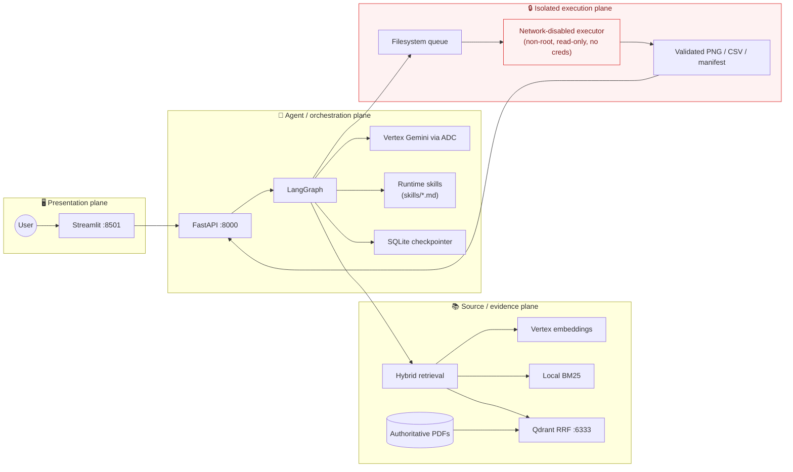
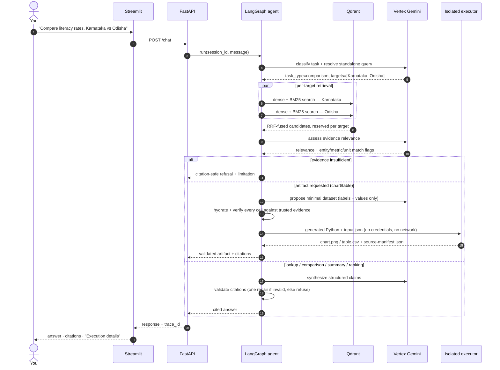

# 📊 Census Insight Agent

**A citation-grounded chatbot over Census 2011 India state reports — every factual claim traces back to an exact PDF page, checksum, and verbatim quote, or the system refuses rather than guesses.**

[](https://github.com/rmnvg/census-insight-agent/actions/workflows/ci.yml)


Ask it about literacy rates, population, sex ratios, and district rankings across Karnataka, Odisha,
and Madhya Pradesh. It looks things up, summarizes, compares, ranks, checks internal consistency,
and builds charts/tables — and it says "I don't know" instead of making something up.

## Demo video

[](docs/demo/census-insight-demo.mp4)

**[Watch or download the demo (MP4, about 3½ minutes)](docs/demo/census-insight-demo.mp4)** ·
[Transcript](docs/demo/TRANSCRIPT.md) · [Captions](docs/demo/census-insight-demo.srt)

Recorded from the running application on September 7, 2026, with synthetic English narration.
Covers architecture, healthy services, a cited lookup, a follow-up, chart generation, and an
out-of-scope refusal. Model waiting time is edited out and selected frames are held for explanation.
The follow-up comparison failed citation validation in this run; the video preserves and explains
that result. The lookup and chart succeeded. `make check` passed all 305 tests.

The video is included in the repository. If GitHub shows a file page instead of a player, use
**View raw** or **Download raw file** to watch it.

---

## Table of contents

- [Demo video](#demo-video)
- [What makes this different](#what-makes-this-different)
- [Architecture](#architecture)
- [How a request actually flows](#how-a-request-actually-flows)
- [The provenance chain](#the-provenance-chain-the-core-guarantee)
- [What it can do](#what-it-can-do)
- [Quick start](#quick-start)
- [Data setup and first initialization](#data-setup-and-first-initialization)
- [Run and review](#run-and-review)
- [Safety and behavior](#safety-and-behavior)
- [Verification and evaluation](#verification-and-evaluation)
- [API and traces](#api-and-traces)
- [Troubleshooting](#troubleshooting)
- [Repository layout](#repository-layout)
- [Further reading](#further-reading)

---

## What makes this different

A lot of "chat with your documents" demos silently give up citation accuracy the moment the answer
requires a computed comparison, a chart, or a district ranking. This one doesn't:

| | Typical RAG chatbot | Census Insight Agent |
|---|---|---|
| Citations | Page number, sometimes | Exact verbatim quote **+** physical PDF page **+** SHA-256 checksum, verified by application code — never trusted from the model |
| Comparisons ("how does X compare to Y") | Model does the subtraction in prose | Arithmetic is app-owned; the model never asserts a computed number that wasn't independently calculated |
| Charts/tables | Pre-baked template, or the model fabricates numbers | Model proposes *which* data; application code hydrates and verifies every cell against a trusted table row before any code executes |
| Code execution | Often absent, or runs unsandboxed | Generated Python passes an AST policy gate, then runs in a non-root, network-disabled, read-only container with resource limits |
| "I don't know" | Rare — models like to please | A structural outcome: insufficient evidence, a failed provenance check, or an unverifiable table cell all produce an explicit refusal |
| Memory | Conversation replayed as prose | Structured, validated claim history — a follow-up re-verifies against live evidence, it never trusts what a past turn *said* |

## Architecture

Four services, four trust boundaries. The frontend never touches Qdrant, credentials, or the
executor; the executor never touches the network, Qdrant, or credentials.



## How a request actually flows

This is what happens between you hitting <kbd>Enter</kbd> and an answer appearing — classification,
per-target retrieval, evidence assessment, and a citation-validation gate that can trigger one
bounded repair before it ever refuses.



## The provenance chain (the core guarantee)

Every number the agent ever states can be walked backward to a specific, checksummed page. Nothing
skips a link in this chain — a broken link anywhere produces a refusal, not a guess.

```mermaid
flowchart LR
    PDF["📄 Original PDF\nchecksum + page count"] --> MAP["Page mapping\nMarkdown-preferred, PDF-anchored"]
    MAP --> CHUNK["Page-bounded chunk\nnever spans pages"]
    CHUNK --> VEC["Dense + BM25 vectors"]
    VEC --> QD["Qdrant point\nchunk + checksum + page"]
    QD --> RET["Retrieved candidate"]
    RET --> ASSESS["LLM relevance assessment"]
    ASSESS --> CLAIM["Structured claim\napp-built, not model-written"]
    CLAIM --> CITE["✅ Citation\nexact quote + physical PDF page"]
    CITE --> OUT["Answer or artifact"]

    style PDF fill:#fee2e2,stroke:#991b1b,color:#7f1d1d
    style CITE fill:#dcfce7,stroke:#166534,color:#14532d
    style OUT fill:#dbeafe,stroke:#1e40af,color:#1e3a8a
```



If any link breaks — an excluded visual page, a non-verbatim snippet, an unverifiable table cell —
the chain stops and the system says so instead of silently continuing.

## What it can do

| You ask | Task type | What actually happens |
|---|---|---|
| "What was Karnataka's literacy rate in 2011?" | `lookup` | Retrieves, cites the exact table cell |
| "How does that compare with Odisha?" | `comparison` | Retrieves both sides independently, computes a validated arithmetic difference |
| "Summarize the key findings for Odisha" | `summary` | Page-distributed representative retrieval, not just the top-k hits |
| "Which district had the highest gender ratio?" | `artifact_table` (ranking) | Full-table scan; the *winner* is computed by application code, never asserted by the model |
| "Create a bar chart comparing Karnataka and Odisha literacy rates" | `artifact_chart` | Model proposes labels/values only; app hydrates and verifies every cell before the isolated executor renders a PNG |
| "Build a table of the urban vs rural breakdown" | `artifact_table` | Same hydration/verification path, output is `table.csv` + `table.md` |
| "Check whether the population totals in this table are consistent" | `inconsistency_analysis` | Deterministic arithmetic tool calls, checked against the same citation-validation gate |
| "Which source pages support those values?" | `source_support` | Rehydrates prior validated claims against **current** Qdrant state — never trusts conversation prose |
| "What was France's unemployment rate in 2011?" | `out_of_scope` | Refuses cleanly — no hallucinated cross-corpus answer |

## Quick start

### Reviewer quick start

The submission ZIP includes the three original PDFs and supplied Markdown. A Git checkout requires
copying those files into `data/source/` as described [below](#data-setup-and-first-initialization).
Credentials are never included. Vertex inference and first-time embeddings are billable.

After completing the ADC and `.env` configuration below, run:

```shell
sh scripts/setup.sh --allow-paid-calls
```

This builds images, checks source-page coverage, initializes an empty index, prepares Linux queue
permissions, and waits for healthy services. It preserves an existing valid collection. Open
<http://localhost:8501>. Subsequent starts need only `docker compose up -d --wait`.
The one-shot `queue-init` container exits successfully; the four application services stay running.
Windows users should use WSL2 with Docker Desktop integration enabled.

### Credentials

For the complete application, install Docker Engine/Desktop with Compose v2 and the Google Cloud CLI.
For host-side development, also install Python 3.12 and [`uv`](https://docs.astral.sh/uv/). The
backend requires a Vertex-enabled GCP project and Application Default Credentials (ADC); API-key
authentication is unsupported.

```shell
gcloud auth application-default login
gcloud auth application-default set-quota-project YOUR_PROJECT_ID
cp .env.example .env
```

In `.env`, set `GOOGLE_CLOUD_PROJECT`, the Gemini model names, and `GOOGLE_CREDENTIALS_HOST_PATH` to
the absolute host ADC JSON path. Keep `GOOGLE_APPLICATION_CREDENTIALS=/var/secrets/google/adc.json`;
it is the intentional container-local mount. Never copy credentials into the repository.

> **Why Vertex/ADC instead of a free-credit API key?** Short version: project-scoped GCP identity
> without distributing a secret, at the cost of a slower reviewer setup. This tradeoff is made
> explicitly, not overlooked — see [DESIGN.md § Tradeoffs](DESIGN.md#tradeoffs-alternatives-and-intentionally-skipped-work).

## Data setup and first initialization

The assignment corpus is ignored because its PDFs and Markdown total about 115 MB. Copy the supplied
files into:

```text
data/source/pdf/
  PC11_PCA_Data_Highlights_Karnataka.pdf
  PC11_PCA_Data_Highlights_Odisha.pdf
  PCA Data Highlights MP.pdf
data/source/markdown/
  PC11_PCA_Data_Highlights_Karnataka.md
  PC11_PCA_Data_Highlights_Odisha.md
  PCA Data Highlights MP.md
```

Pairing and reviewed page-coverage decisions are checked in under `data/manifests/`. Run the free dry
run first; it makes no Gemini calls and no Qdrant writes:

```shell
docker compose run --rm --no-deps --build backend uv run --frozen python -m backend.app.ingestion.cli ingest --source-dir /app/data/source --dry-run --report-output /app/data/processed/dry-run-report.json
python3 -m json.tool data/processed/dry-run-report.json
```

After reviewing zero failures and the estimated inputs, initialize an empty collection intentionally.
The initializer stops unless the paid-call flag is present, skips a valid 2,058-point collection, and
never deletes a non-matching collection:

```shell
docker compose up -d qdrant
docker compose run --rm backend uv run --frozen python scripts/initialize_corpus.py --allow-paid-calls
```

Initial ingestion invokes billable Vertex embeddings. A fresh `docker compose up --build` starts the
services but cannot answer corpus questions until the assignment files are supplied and
initialization is approved.

## Run and review

```shell
docker compose up --build
```

The first build and FastEmbed load can take several minutes. Wait for `docker compose ps` to show
four healthy services.

| Service | URL |
|---|---|
| Streamlit chat UI | <http://localhost:8501> |
| FastAPI / OpenAPI docs | <http://localhost:8000/docs> |
| Qdrant dashboard | <http://localhost:6333/dashboard> |

Try the [example prompts above](#what-it-can-do) in one conversation — ask the lookup, then the
follow-up comparison, then a chart, to see memory, citations, and artifacts all in the same thread.

Stop without removing indexed data:

```shell
docker compose down
```

Never add `--volumes` unless deleting the local Qdrant collection is intentional.

## Safety and behavior

Original PDFs define identity, checksum, page count, and citation page. Supplied Markdown is
preferred; PyMuPDF4LLM is fallback-only. Chunks never cross pages. Twelve unsafe Karnataka chart/map
pages remain quarantined as `excluded_unverified_visual`; raw OCR never reaches embeddings, Qdrant,
retrieval, or generation.

Every query gets Vertex dense and local BM25 sparse vectors; Qdrant performs RRF. Retrieval is
candidate selection only. LangGraph assesses evidence, builds typed claims, selects exact spans from
trusted current-run chunks, validates provenance, and answers or refuses. Comparisons reserve
evidence budget for both regions.

`AsyncSqliteSaver` stores successful conversation state in `workspace/checkpoints.sqlite`. Run-local
errors do not become durable claims. Runtime instructions are discovered from `skills/*.md`. Artifact
proposals are deterministically hydrated with trusted evidence before generated Python reaches the
unprivileged, network-disabled executor.

The executor has no cloud credentials, Qdrant, Docker socket, network, or session workspace. Docker
isolation is **not** a hardened hostile multi-tenant sandbox; production use should add a stronger
sandbox such as microVM isolation.

## Verification and evaluation

A [GitHub Actions workflow](.github/workflows/ci.yml) runs the full offline gate — format, lint,
type check, all 305 tests, an offline UI smoke test, a Compose trust-boundary audit, and a
git-history secret scan — on every push, with no billable calls. Badge at the top of this file
reflects the current `main` branch.

Run the same gate locally:

```shell
uv sync --frozen --all-extras
make check
make secret-scan
```

With the services and local corpus running, the canonical full offline gate adds an exhaustive
read-only collection scan and dense/sparse compatibility queries. It performs no ingestion, Qdrant
writes, Gemini generation, or Vertex embeddings:

```shell
make verify-offline
```

Useful individual commands include `make format-check`, `make lint`, `make typecheck`, `make test`,
`make ui-smoke`, `make qdrant-readonly`, `docker compose config --quiet`, and
`docker compose exec frontend python -m frontend.security_check`.

The real-corpus retrieval evaluator uses a paid Vertex query embedding and is manual:

```shell
docker compose exec backend uv run --frozen python evals/run_retrieval.py --cases evals/real_corpus_cases.json --output /app/data/processed/retrieval-evaluation-report.json
```

The eleven-case live harness is also manual, requires explicit consent, never retries `POST /chat`,
and stores a sanitized report:

```shell
docker compose exec backend uv run --frozen python scripts/live_evaluation.py --allow-paid-calls --output /app/data/processed/live-evaluation-report.json
```

Vertex connectivity alone can be checked with the billable `make verify-vertex` command.

## API and traces

```shell
curl -sS -X POST http://localhost:8000/sessions
curl -sS -X POST http://localhost:8000/chat -H 'content-type: application/json' -d '{"session_id":"SESSION_ID","message":"What was Karnataka’s literacy rate in 2011?"}'
curl -sS http://localhost:8000/runs/TRACE_ID/trace
```

Trace IDs are allocated at request start and remain retrievable for typed failures. UI "Execution
details" shows allowlisted operational fields only. Files under `workspace/` are ignored local state.

## Troubleshooting

| Symptom | Fix |
|---|---|
| `port is already allocated` | Stop the other process/container using 6333. Do not remove the Qdrant volume. |
| `pytest: executable file not found` | Run `uv run --frozen pytest -q`; dev tools are not directly on the production image `PATH`. |
| `Unknown session` | Call `POST /sessions`, then pass its returned ID in valid JSON. |
| UI stays pending | Rebuild frontend/backend and inspect their logs; `POST /chat` is intentionally not retried. |
| Backend unhealthy | Verify ADC mount, project/location/model values, Qdrant, and executor heartbeat. |

Known limitations: excluded visual-page content, no token streaming, no URL-based browser session
restoration, synchronous administrative ingestion, loopback-only services without user
authentication, and development-grade executor isolation. See [DESIGN.md](DESIGN.md) and
[FAILURE_ANALYSIS.md](FAILURE_ANALYSIS.md) for the full, honest accounting — including inputs where
this system degrades, why, and what a real fix looks like.

## Repository layout

```text
backend/app/       FastAPI, ingestion, retrieval, LangGraph, lineage
backend/tests/     Unit and integration tests
frontend/          Streamlit client, models, renderers, tests
executor/          Isolated worker and code policy
skills/            Runtime Markdown skills
data/manifests/    Pairing and reviewed coverage decisions
data/source/       Locally supplied corpus (ignored)
evals/             Evaluation cases and retrieval evaluator
scripts/           Checks, replays, initialization, live harness
workspace/         Ignored checkpoints, traces, queue, artifacts
docs/              Decisions and reviewer preparation
```

## Further reading

| Document | What's in it |
|---|---|
| [DESIGN.md](DESIGN.md) | The why behind every trust boundary — provenance, retrieval, artifact execution, ranking, and the tradeoffs taken under time pressure |
| [FAILURE_ANALYSIS.md](FAILURE_ANALYSIS.md) | Real inputs where the system broke or degraded, root cause, and the fix — including gaps left open on purpose |
| [docs/DECISIONS.md](docs/DECISIONS.md) | Binding platform decisions in one page |
| [docs/REQUIREMENTS.md](docs/REQUIREMENTS.md) | Assignment requirement → implementation map |
| [docs/INTERVIEW_NOTES.md](docs/INTERVIEW_NOTES.md) | 60-second architecture pitch and likely evaluator questions |
| [docs/VIDEO_SCRIPT.md](docs/VIDEO_SCRIPT.md) | Five-minute walkthrough script |
| [docs/SUBMISSION_CHECKLIST.md](docs/SUBMISSION_CHECKLIST.md) | Pre-submission readiness checklist |
