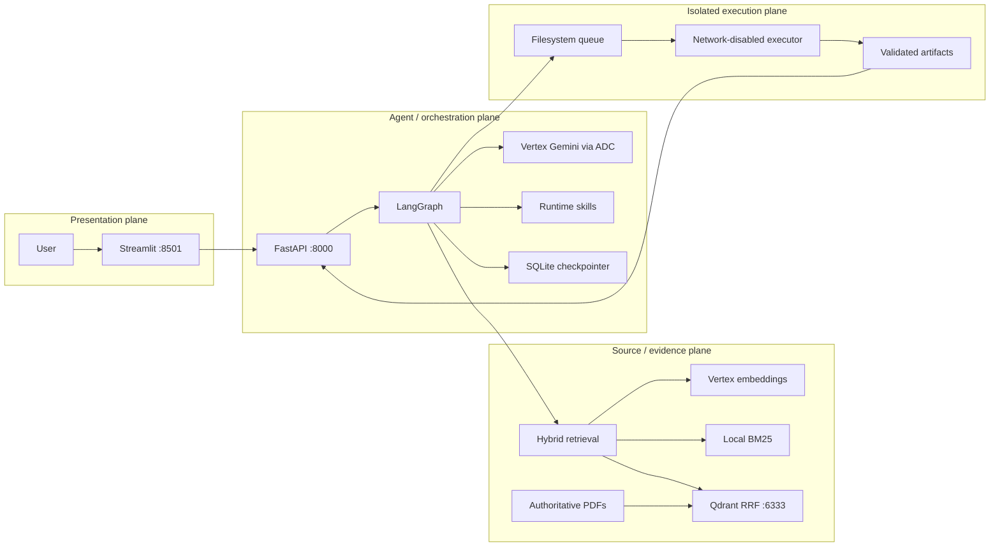

# Census Insight Agent

Census Insight Agent is a citation-grounded assistant for three supplied Census 2011 state reports. It combines provided-Markdown-first ingestion, physical PDF-page provenance, Vertex AI Gemini, Qdrant dense+sparse retrieval, LangGraph memory, and a network-isolated artifact executor. Every factual claim maps to an exact source span; uncertain visual pages are disclosed as coverage limitations rather than converted into unsafe evidence.

## Capabilities and architecture

- Grounded lookup, comparison, summary, source-follow-up, and inconsistency analysis
- Mandatory dense + BM25 sparse retrieval fused by Qdrant RRF
- Exact citation quotes with one-based physical PDF pages
- LangGraph SQLite conversation memory and runtime Markdown skills
- Validated PNG/CSV/Markdown artifacts with checksum-bound source manifests
- Typed operational failures, sanitized traces, and a separated Streamlit UI



## Prerequisites and credentials

For the complete application, install Docker Engine/Desktop with Compose v2 and the Google Cloud CLI. For host-side development, also install Python 3.12 and [`uv`](https://docs.astral.sh/uv/). The backend requires a Vertex-enabled GCP project and Application Default Credentials (ADC); API-key authentication is unsupported.

```shell
gcloud auth application-default login
gcloud auth application-default set-quota-project YOUR_PROJECT_ID
cp .env.example .env
```

In `.env`, set `GOOGLE_CLOUD_PROJECT`, the Gemini model names, and `GOOGLE_CREDENTIALS_HOST_PATH` to the absolute host ADC JSON path. Keep `GOOGLE_APPLICATION_CREDENTIALS=/var/secrets/google/adc.json`; it is the intentional container-local mount. Never copy credentials into the repository.

## Data setup and first initialization

The assignment corpus is ignored because its PDFs and Markdown total about 115 MB. Copy the supplied files into:

```text
data/source/pdf/
  PC11_PCA_Data_Highlights_Karnataka.pdf
  PC11_PCA_Data_Highlights_Odisha.pdf
  PCA Data Highlights MP.pdf
data/source/markdown/
  PC11_PCA_Data_Highlights_Karnataka.md
  PC11_PCA_Data_Highlights_Odisha.md
  PCA Data Highlights MP.md
```

Pairing and reviewed page-coverage decisions are checked in under `data/manifests/`. Run the free dry run first; it makes no Gemini calls and no Qdrant writes:

```shell
docker compose run --rm --no-deps --build backend uv run --frozen python -m backend.app.ingestion.cli ingest --source-dir /app/data/source --dry-run --report-output /app/data/processed/dry-run-report.json
python3 -m json.tool data/processed/dry-run-report.json
```

After reviewing zero failures and the estimated inputs, initialize an empty collection intentionally. The initializer stops unless the paid-call flag is present, skips a valid 2,058-point collection, and never deletes a non-matching collection:

```shell
docker compose up -d qdrant
docker compose run --rm backend uv run --frozen python scripts/initialize_corpus.py --allow-paid-calls
```

Initial ingestion invokes billable Vertex embeddings. A fresh `docker compose up --build` starts the services but cannot answer corpus questions until the assignment files are supplied and initialization is approved.

## Run and review

```shell
docker compose up --build
```

The first build and FastEmbed load can take several minutes. Wait for `docker compose ps` to show four healthy services.

- Streamlit: <http://localhost:8501>
- FastAPI/OpenAPI: <http://localhost:8000/docs>
- Qdrant dashboard: <http://localhost:6333/dashboard>

Ask these in one UI conversation:

1. “What was Karnataka’s literacy rate in 2011?”
2. “How does that compare with Odisha?”
3. “Which source pages support those values?”
4. “Create a bar chart comparing the 2011 total persons literacy rates for Karnataka and Odisha.”
5. “Create a table comparing the 2011 total, rural, and urban literacy rates for Karnataka and Odisha.”
6. “Which district had the highest sex ratio in Madhya Pradesh?”
7. “What was France’s unemployment rate in 2011?”

Stop without removing indexed data:

```shell
docker compose down
```

Never add `--volumes` unless deleting the local Qdrant collection is intentional.

## Safety and behavior

Original PDFs define identity, checksum, page count, and citation page. Supplied Markdown is preferred; PyMuPDF4LLM is fallback-only. Chunks never cross pages. Twelve unsafe Karnataka chart/map pages remain quarantined as `excluded_unverified_visual`; raw OCR never reaches embeddings, Qdrant, retrieval, or generation.

Every query gets Vertex dense and local BM25 sparse vectors; Qdrant performs RRF. Retrieval is candidate selection only. LangGraph assesses evidence, builds typed claims, selects exact spans from trusted current-run chunks, validates provenance, and answers or refuses. Comparisons reserve evidence budget for both regions.

`AsyncSqliteSaver` stores successful conversation state in `workspace/checkpoints.sqlite`. Run-local errors do not become durable claims. Runtime instructions are discovered from `skills/*.md`. Artifact proposals are deterministically hydrated with trusted evidence before generated Python reaches the unprivileged, network-disabled executor.

The executor has no cloud credentials, Qdrant, Docker socket, network, or session workspace. Docker isolation is **not** a hardened hostile multi-tenant sandbox; production use should add a stronger sandbox such as microVM isolation.

## Verification and evaluation

Host-side checks use the lockfile and make no external model calls:

```shell
uv sync --frozen --all-extras
make check
make secret-scan
```

With the services and local corpus running, the canonical full offline gate adds an exhaustive read-only collection scan and dense/sparse compatibility queries. It performs no ingestion, Qdrant writes, Gemini generation, or Vertex embeddings:

```shell
make verify-offline
```

Useful individual commands include `make format-check`, `make lint`, `make typecheck`, `make test`, `make ui-smoke`, `make qdrant-readonly`, `docker compose config --quiet`, and `docker compose exec frontend python -m frontend.security_check`.

The real-corpus retrieval evaluator uses a paid Vertex query embedding and is manual:

```shell
docker compose exec backend uv run --frozen python evals/run_retrieval.py --cases evals/real_corpus_cases.json --output /app/data/processed/retrieval-evaluation-report.json
```

The ten-case live harness is also manual, requires explicit consent, never retries `POST /chat`, and stores a sanitized report:

```shell
docker compose exec backend uv run --frozen python scripts/live_evaluation.py --allow-paid-calls --output /app/data/processed/live-evaluation-report.json
```

Vertex connectivity alone can be checked with the billable `make verify-vertex` command.

## API and traces

```shell
curl -sS -X POST http://localhost:8000/sessions
curl -sS -X POST http://localhost:8000/chat -H 'content-type: application/json' -d '{"session_id":"SESSION_ID","message":"What was Karnataka’s literacy rate in 2011?"}'
curl -sS http://localhost:8000/runs/TRACE_ID/trace
```

Trace IDs are allocated at request start and remain retrievable for typed failures. UI “Execution details” shows allowlisted operational fields only. Files under `workspace/` are ignored local state.

## Troubleshooting

- `port is already allocated`: stop the other process/container using 6333. Do not remove the Qdrant volume.
- `pytest: executable file not found`: run `uv run --frozen pytest -q`; dev tools are not directly on the production image `PATH`.
- `Unknown session`: call `POST /sessions`, then pass its returned ID in valid JSON.
- UI stays pending: rebuild frontend/backend and inspect their logs; `POST /chat` is intentionally not retried.
- Backend unhealthy: verify ADC mount, project/location/model values, Qdrant, and executor heartbeat.

Known limitations: excluded visual-page content, no token streaming, no URL-based browser session restoration, synchronous administrative ingestion, local Qdrant ports without TLS/auth, and development-grade executor isolation. See [DESIGN.md](DESIGN.md) and [FAILURE_ANALYSIS.md](FAILURE_ANALYSIS.md).

## Repository layout

```text
backend/app/       FastAPI, ingestion, retrieval, LangGraph, lineage
backend/tests/     Unit and integration tests
frontend/          Streamlit client, models, renderers, tests
executor/          Isolated worker and code policy
skills/            Runtime Markdown skills
data/manifests/    Pairing and reviewed coverage decisions
data/source/       Locally supplied corpus (ignored)
evals/             Evaluation cases and retrieval evaluator
scripts/           Checks, replays, initialization, live harness
workspace/         Ignored checkpoints, traces, queue, artifacts
docs/              Decisions and reviewer preparation
```

Continue with [DESIGN.md](DESIGN.md), [docs/INTERVIEW_NOTES.md](docs/INTERVIEW_NOTES.md), [docs/VIDEO_SCRIPT.md](docs/VIDEO_SCRIPT.md), and [docs/SUBMISSION_CHECKLIST.md](docs/SUBMISSION_CHECKLIST.md).
